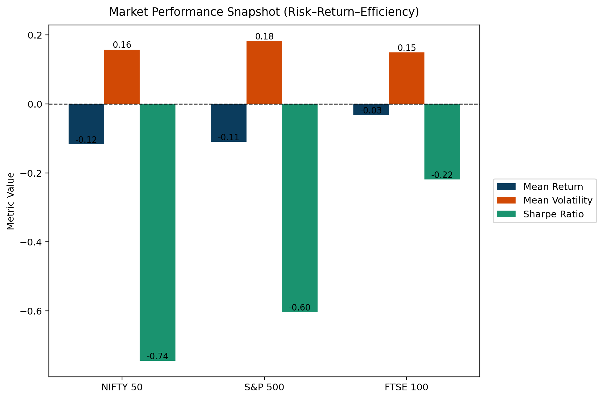
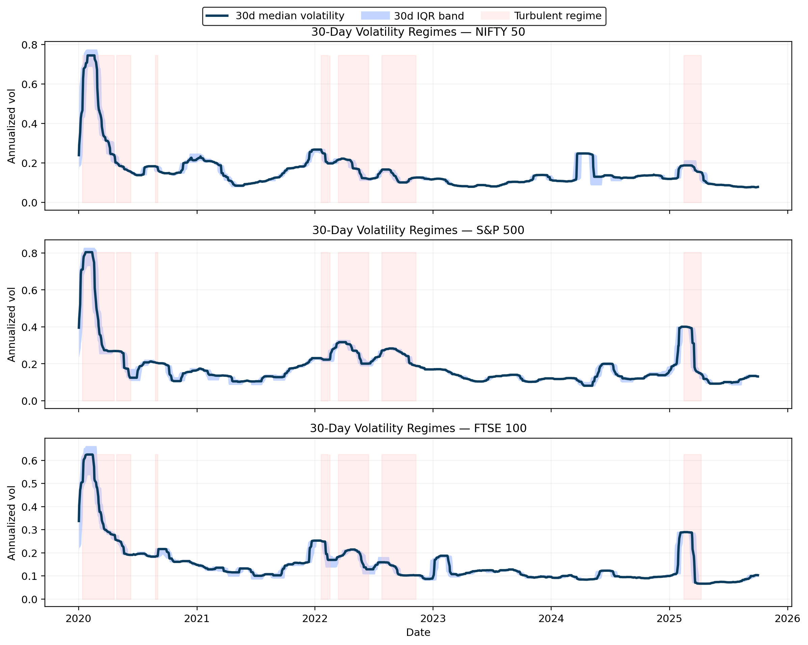
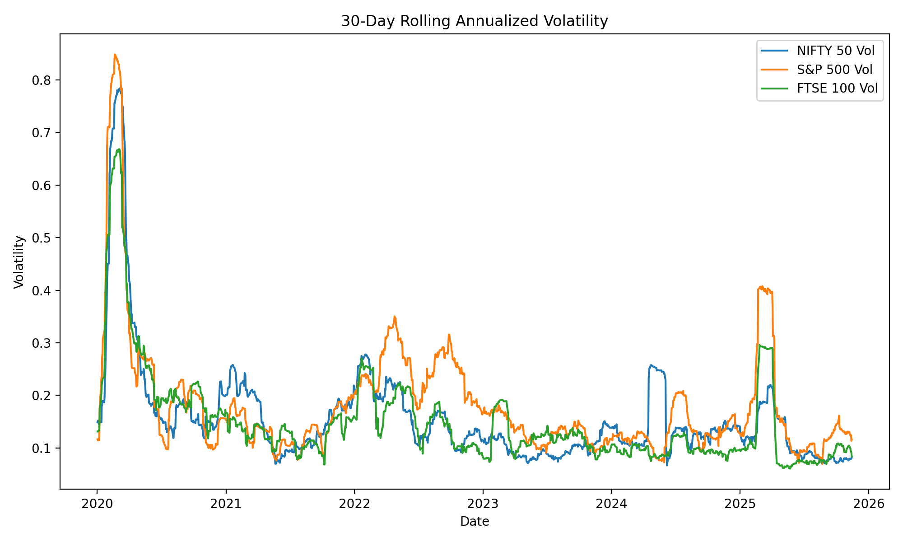
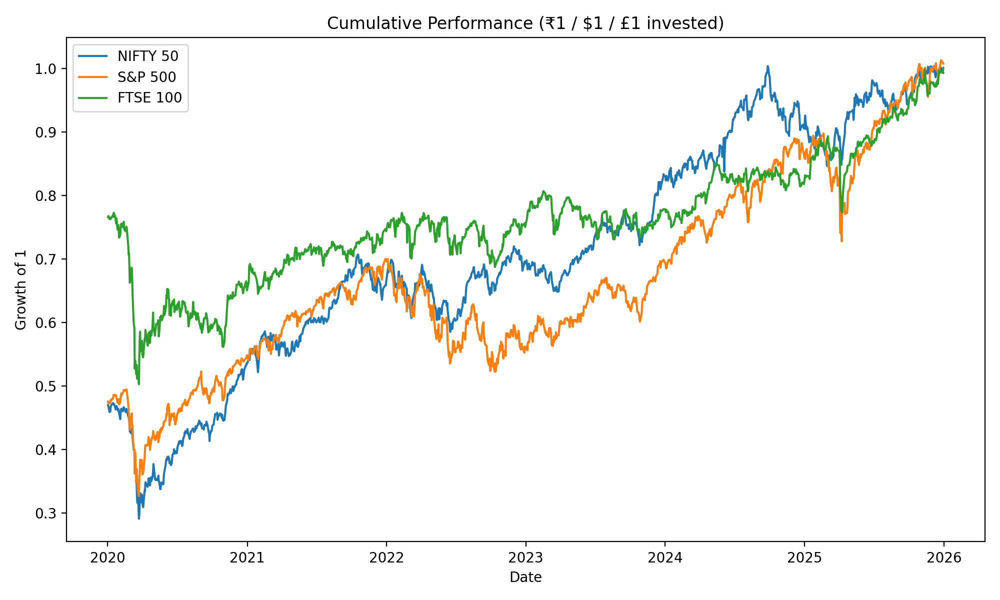

# 🌍 Global Market Stress Analysis (2020–2026)

This project studies how major equity markets behaved under repeated stress episodes from 2020 to 2026. The emphasis is on **transparent, interpretable quantitative analysis** rather than trading strategies or black-box machine learning.

The core objective is **diagnosis, not prediction** — understanding how risk evolves, how crises propagate, and how markets behave when equilibrium assumptions break down.

---

## 📌 Markets Analyzed

- **NIFTY 50 (India)**
- **S&P 500 (United States)**
- **FTSE 100 (United Kingdom)**  

Daily historical prices from 2020–2026 are used. All computations are reproducible in Python.

---

# 📊 KEY FINDINGS (WITH PROPERLY TAGGED IMAGES)

Each finding below is explicitly tied to one figure from your repository.

---

## **1) Risk–Return Inefficiency in a Crisis Regime**

This figure summarizes four key metrics across markets:

- Mean return  
- Mean volatility  
- Maximum drawdown  
- Sharpe ratio  

### What this image shows

- **All three markets show negative mean returns** over 2020–2026, confirming that this is a stress-dominated period rather than a normal growth cycle.  
- **S&P 500 has the highest volatility (~0.18)** but still delivers poor risk-adjusted performance (Sharpe ≈ −0.60).  
- **NIFTY 50 is the most fragile in risk-adjusted terms** (Sharpe ≈ −0.74).  
- **FTSE 100 performs relatively better** (Sharpe ≈ −0.22), indicating smoother behavior during global turmoil.

### Interpretation

This chart reframes the entire study:  
> 2020–2026 should be treated as a *stress regime*, not a normal market cycle.

Traditional performance evaluation (Sharpe ratio) looks poor everywhere because risk dominated returns.

---

## **2) Volatility Clustering and Turbulent Regimes**

This visualization overlays:

- 30-day median volatility  
- Interquartile (IQR) bands  
- Highlighted turbulent periods  

### What we learn

- **Volatility clusters in time** — once markets become turbulent, they remain turbulent for extended periods.  
- Major spikes align across all three markets around:
  - Early 2020 (COVID crash)  
  - 2022 (inflation + rate hikes)  
  - Late 2024 (renewed drawdowns)

### Key takeaway

Markets behave as a **connected system under stress**, supporting a classic empirical finance result:

> *Volatility is persistent and contagious across markets.*

---

## **3) Comparative Risk Dynamics Across Markets**

This chart plots 30-day rolling annualized volatility for all three indices together.

### What it shows

- **S&P 500 consistently exhibits the highest volatility.**  
- **FTSE 100 is the most stable**, rarely reaching extreme spikes.  
- **NIFTY 50 sits in between**, but experiences sharper jumps during crises.

### Risk interpretation

If an institutional investor wanted:

- Lower risk → **FTSE 100**  
- Higher risk exposure → **S&P 500**  
- Emerging market sensitivity → **NIFTY 50**

This figure justifies those classifications quantitatively.

---

## **4) Path-Dependent Wealth Under Repeated Shocks**

This plot tracks how ₹1 / $1 / £1 grows in each market from 2020 onward.

### What it reveals

- All three markets suffered deep drawdowns in 2020.  
- Recovery is **jagged, uneven, and non-linear**, not smooth exponential growth.  
- Wealth paths **diverge sharply during crises** and only gradually reconverge.

### Core conclusion

Market performance is **shock-driven rather than trend-driven**.

This reinforces the central thesis of the project:

> Markets are structurally fragile under stress, not self-correcting toward equilibrium.

---

# 🧮 Methods (What you actually did)

1. **Data Processing**
   - Cleaned and aligned daily prices  
   - Computed log returns  

2. **Risk Estimation**
   - 30-day rolling annualized volatility  
   - Maximum drawdown  
   - Sharpe ratio  

3. **Stress Identification**
   - Labeled turbulent periods based on elevated volatility  
   - Visualized clustering and co-movement  

4. **Comparative Analysis**
   - Cross-market volatility comparison  
   - Cumulative performance benchmarking  

---

# 🎯 Why this project is strong for GitHub / MSc applications

This project demonstrates:

- Rigorous data cleaning  
- Financial intuition  
- Professional visualization  
- Interpretable quantitative methods  
- Real-world risk framing  

It is appropriate for:
- Data science portfolios  
- Quant finance track records  
- Master’s applications in Finance, Data Science, or Financial Mathematics  

---

# 🚀 Optional Next Steps (if you expand later)

You could extend this work with:

- Cross-market volatility spillover analysis  
- Lead–lag relationships between indices  
- Regime-switching models  
- Tail risk (CVaR) instead of volatility  
- Stress contagion modeling  

---

## 📌 Reproducibility

All results are fully reproducible using the provided notebooks and source code.

